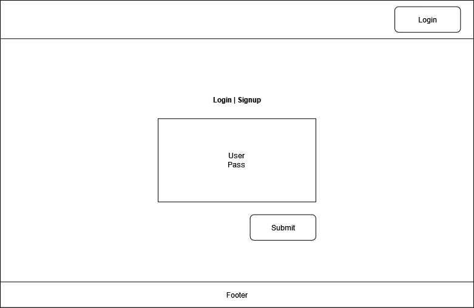
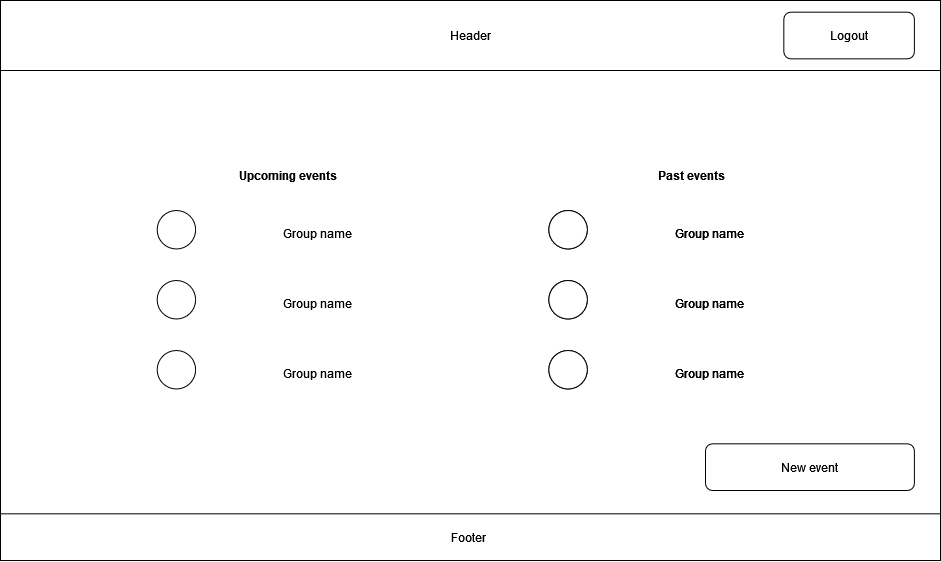
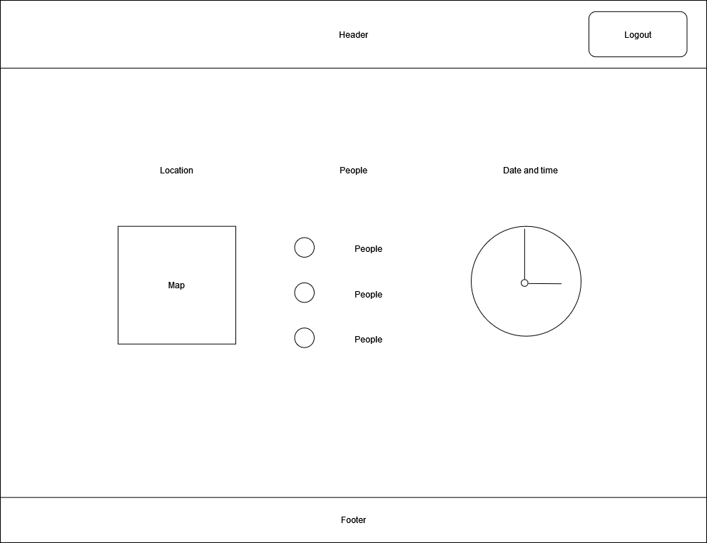
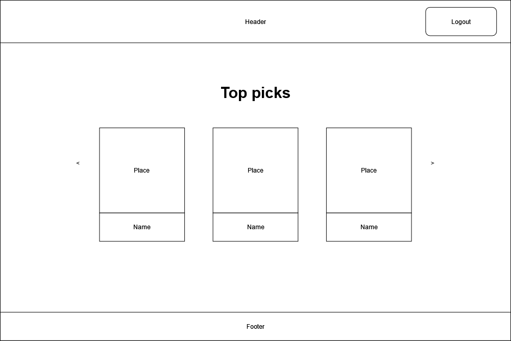

# Project Planning
For this assignment, you'll create some initial plans for your project.

## Assignment Description
[Project Planning Assignment](https://education.launchcode.org/liftoff/modules/assignments/project-planning)

## Submission Instructions

### Wireframes

Include at least 3 wireframes here, adding images or files to your repository as necessary. Format them as a bulleted/unordered list with links to the files.

  
  
  
  
  

### Project Tracker

Include a link to [your public Trello board](https://trello.com/b/6yKd3j3B/project-tracking). Be sure you have user stories added for at least your first 2-week sprint.

### Project Repo Link

Include a [link to your project on GitHub](https://github.com/Apr-23-LC-LiftOff-STL/team-kat).
